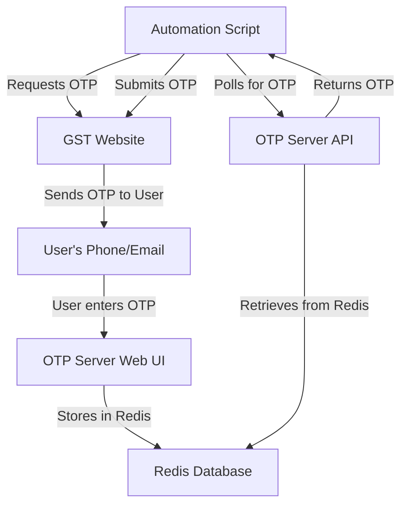
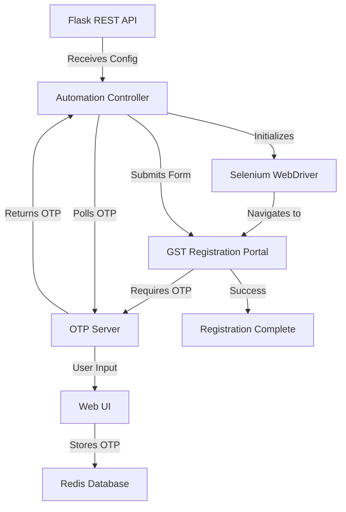

# 🏛️ GST Registration Automation System

A comprehensive automation system for GST (Goods and Services Tax) registration in India, built with Python, Selenium, and Flask. This system automates the entire GST registration process including form filling, OTP handling, document verification, and provides a REST API for integration.

## 📋 Table of Contents

- [🔥 Features](#-features)
- [🛠️ Technologies & Libraries](#️-technologies--libraries)
- [🚀 Installation](#-installation)
- [🔧 Configuration](#-configuration)
- [💻 Usage](#-usage)
- [🌐 API Documentation](#-api-documentation)
- [📞 OTP Server](#-otp-server)
- [🐳 Docker Setup](#-docker-setup)
- [📁 Project Structure](#-project-structure)
- [🔍 How It Works](#-how-it-works)
- [🐛 Troubleshooting](#-troubleshooting)

## 🔥 Features

- **Automated GST Registration**: Complete automation of GST registration form filling
- **CAPTCHA Solving**: Integration with TrueCaptcha API for automatic CAPTCHA solving
- **OTP Management**: Real-time OTP handling through a dedicated Flask server
- **Multi-Entity Support**: Handles LLP, Private Limited, Partnership, and other entity types
- **Document Automation**: Automated handling of promoter and authorized signatory details
- **REST API**: Flask-based REST API with Swagger UI for easy integration
- **Docker Support**: Complete containerization with Docker and Docker Compose
- **Comprehensive Logging**: Detailed logging for debugging and monitoring
- **Error Recovery**: Robust error handling with retry mechanisms

## 🛠️ Technologies & Libraries

### Core Dependencies

| Library | Version | Purpose |
|---------|---------|---------|
| **selenium** | 4.33.0 | Web browser automation and form filling |
| **requests** | 2.32.4 | HTTP requests for CAPTCHA solving and API calls |
| **python-dotenv** | 1.1.1 | Environment variable management |

### Flask API Stack

| Library | Version | Purpose |
|---------|---------|---------|
| **Flask** | 3.0.0 | Web framework for REST API |
| **Flask-RESTX** | 1.3.0 | REST API with automatic Swagger documentation |
| **Werkzeug** | 3.0.1 | WSGI web application library |

### Optional Dependencies

| Library | Version | Purpose |
|---------|---------|---------|
| **flask-cors** | 5.0.0 | Cross-Origin Resource Sharing for OTP server |
| **redis** | 5.2.0 | In-memory data store for OTP management |

### Browser & System Requirements

- **Firefox ESR**: Headless browser for automation
- **Geckodriver**: WebDriver for Firefox automation
- **Xvfb**: Virtual display for headless operation (Docker)

## 🚀 Installation

### Method 1: Local Installation

1. **Clone the repository:**
   ```bash
   git clone <your-repo-url>
   cd GST_REG
   ```

2. **Create and activate virtual environment:**
   ```bash
   python -m venv venv
   source venv/bin/activate  # On Windows: venv\Scripts\activate
   ```

3. **Install dependencies:**
   ```bash
   pip install -r requirements.txt
   ```

4. **Install Firefox and Geckodriver:**
   ```bash
   # On Ubuntu/Debian
   sudo apt-get install firefox-esr
   
   # Download and install geckodriver
   wget https://github.com/mozilla/geckodriver/releases/latest/download/geckodriver-*-linux64.tar.gz
   tar -xzf geckodriver-*-linux64.tar.gz
   sudo mv geckodriver /usr/local/bin/
   ```

5. **Set up environment variables:**
   ```bash
   cp .env.example .env  # Create if needed
   # Edit .env file with your API keys
   ```

### Method 2: Docker Installation (Recommended)

1. **Prerequisites:**
   ```bash
   # Install Docker and Docker Compose
   docker --version
   docker-compose --version
   ```

2. **Build and run:**
   ```bash
   docker-compose up --build
   ```

## 🔧 Configuration

### Environment Variables

Create a `.env` file in the project root:

```env
# TrueCaptcha API credentials
TRUECAPTCHA_USER=your_username
TRUECAPTCHA_KEY=your_api_key

# Redis configuration (for OTP server)
REDIS_URL=redis://localhost:6379/0

# Flask configuration
FLASK_ENV=production
FLASK_DEBUG=false
```

### Configuration Files

1. **`config.json`**: Main configuration for GST registration data
2. **`example_config.json`**: Template showing the required JSON structure
3. **`config.py`**: Element locators and UI identifiers

## 💻 Usage

### Running the Complete System

1. **Start the OTP Server** (Terminal 1):
   ```bash
   python otp_server.py
   ```
   - Accessible at: `http://localhost:3000`
   - UI for manual OTP entry available

2. **Start the Main API** (Terminal 2):
   ```bash
   python app.py
   ```
   - API accessible at: `http://localhost:8001`
   - Swagger UI at: `http://localhost:8001/docs/`

3. **Use the API** (Terminal 3 or any HTTP client):
   ```bash
   curl -X POST http://localhost:8001/api/v1/automate-gst-registration \
     -H "Content-Type: application/json" \
     -d @example_config.json
   ```

### Direct Script Execution

For development or testing individual components:

```bash
# Test promoter partner module
python promoter_partner.py

# Test authorized signatory module
python authorized_signatory.py

# Run with Jupyter notebook
jupyter notebook main.ipynb
```

## 🌐 API Documentation

### Base URL
- **Local**: `http://localhost:8001`
- **Docker**: `http://localhost:8001`

### Endpoints

#### 1. GST Registration Automation
```http
POST /api/v1/automate-gst-registration
```

**Request Body**: JSON configuration (see `example_config.json`)

**Response**:
```json
{
  "success": true,
  "message": "GST registration automation completed successfully",
  "data": {
    "status": "completed",
    "execution_time": "120.5 seconds"
  }
}
```

#### 2. Health Check
```http
GET /api/v1/health
```

**Response**:
```json
{
  "status": "healthy",
  "timestamp": "2024-01-01T12:00:00Z"
}
```

### Swagger Documentation

Visit `http://localhost:8001/docs/` for interactive API documentation with:
- Complete request/response schemas
- Try-it-out functionality
- Parameter validation
- Example requests

## 📞 OTP Server

The OTP server is a crucial component that handles real-time OTP verification during the GST registration process.

### 🔧 How OTP Server Works

1. **Architecture**: Flask-based microservice with Redis backend
2. **Purpose**: Bridges the gap between automated process and manual OTP entry
3. **Storage**: Uses Redis for temporary OTP storage with automatic cleanup
4. **Interface**: Web UI for manual OTP entry during automation

### 🚀 OTP Server Features

- **Multiple OTP Types**: Supports Mobile OTP, Email OTP, and TRN
- **Real-time Processing**: Instant OTP submission and retrieval
- **Validation**: Built-in validation for OTP formats
- **CORS Support**: Cross-origin requests enabled
- **Auto-cleanup**: OTPs are automatically deleted after retrieval
- **Error Handling**: Comprehensive error messages and logging

### 🎯 OTP Flow Process



### 🖥️ OTP Server UI

The OTP server provides a clean, responsive web interface at `http://localhost:3000`:

- **Radio Selection**: Choose OTP type (Mobile/Email/TRN)
- **Input Field**: Enter OTP or TRN value
- **Validation**: Real-time format validation
- **Feedback**: Success/error messages
- **Responsive Design**: Works on desktop and mobile

### 📡 OTP Server API Endpoints

#### Submit Mobile OTP
```http
POST /submit-mobile-otp
Content-Type: application/json

{
  "mobile_otp": "123456"
}
```

#### Submit Email OTP
```http
POST /submit-email-otp
Content-Type: application/json

{
  "email_otp": "654321"  
}
```

#### Submit TRN
```http
POST /submit-trn
Content-Type: application/json

{
  "trn": "1234567890123TRN"
}
```

#### Get OTP (Used by automation)
```http
GET /get-otp?type=mobile_otp
```

### 🛠️ OTP Server Technology Stack

- **Backend**: Flask with Flask-CORS
- **Database**: Redis for in-memory storage
- **Frontend**: Vanilla HTML/CSS/JavaScript
- **Validation**: Custom validation logic
- **Logging**: Python logging module

### 🔄 OTP Server Deployment

**Standalone**:
```bash
python otp_server.py
```

**With Redis**:
```bash
# Start Redis
redis-server

# Start OTP server
PORT=3000 REDIS_URL=redis://localhost:6379/0 python otp_server.py
```

**Docker**:
```bash
# Redis included in docker-compose.yml if needed
docker-compose up otp-server
```

## 🐳 Docker Setup

### Docker Architecture

The system uses a multi-service Docker setup:

```yaml
services:
  gst-automation:     # Main API service
    - Flask REST API
    - Selenium automation
    - Firefox + Geckodriver
    - Virtual display (Xvfb)
```

### Docker Features

- **Headless Operation**: Runs Firefox in headless mode with virtual display
- **Volume Mounts**: Persistent storage for logs, uploads, downloads
- **Health Checks**: Automatic service health monitoring
- **Environment Management**: Proper environment variable handling
- **Optimized Build**: Multi-stage build with minimal final image

### Docker Commands

```bash
# Build and start
docker-compose up --build

# Start in background
docker-compose up -d

# View logs
docker-compose logs -f

# Stop services
docker-compose down

# Rebuild after changes
docker-compose up --build --force-recreate
```

### Docker Environment

The Docker container includes:
- **Python 3.13.0**: Latest Python runtime
- **Firefox ESR**: Stable browser for automation
- **Geckodriver**: Latest WebDriver
- **Xvfb**: Virtual display for headless operation
- **System Dependencies**: All required system packages

## 📁 Project Structure

```
GST_REG/
├── 🐳 Docker Configuration
│   ├── Dockerfile                 # Container definition
│   ├── docker-compose.yml         # Service orchestration
│   ├── docker-entrypoint.sh       # Container startup script
│   └── .dockerignore              # Docker build exclusions
│
├── 🌐 API & Web Interface
│   ├── app.py                     # Main Flask REST API
│   ├── otp_server.py              # OTP handling microservice
│   └── templates/
│       └── index.html             # OTP submission UI
│
├── 🤖 Automation Core
│   ├── functions.py               # Core automation helpers
│   ├── promoter_partner.py        # Promoter data handling
│   ├── authorized_signatory.py    # Signatory data handling
│   └── main.ipynb                 # Jupyter notebook (development)
│
├── ⚙️ Configuration
│   ├── config.py                  # Element locators
│   ├── config.json                # Main configuration
│   ├── example_config.json        # Configuration template
│   └── .env                       # Environment variables
│
├── 📊 Utilities
│   ├── logger.py                  # Logging configuration
│   └── requirements.txt           # Python dependencies
│
├── 📁 Data Directories
│   ├── logs/                      # Application logs
│   ├── uploads/                   # File uploads
│   └── downloads/                 # Downloaded files
│
└── 📚 Documentation
    ├── README.md                  # This file
    ├── README_API.md              # API-specific documentation
    └── DOCKER_README.md           # Docker-specific guide
```

## 🔍 How It Works

### 1. System Architecture



### 2. Automation Workflow

1. **Initialization**:
   - Load configuration from JSON
   - Initialize WebDriver with Firefox
   - Set up logging and error handling

2. **Form Navigation**:
   - Navigate to GST registration portal
   - Handle initial CAPTCHA using TrueCaptcha API
   - Fill entity details (name, type, location)

3. **Document Processing**:
   - Upload required documents
   - Fill promoter/partner details
   - Handle authorized signatory information

4. **Verification Steps**:
   - Submit mobile OTP via OTP server
   - Handle email verification
   - Process Aadhaar OTP
   - Submit TRN information

5. **Final Submission**:
   - Complete final verification
   - Handle closing steps
   - Generate completion report

### 3. Error Handling & Recovery

- **Retry Mechanisms**: Automatic retry for failed operations
- **Screenshot Capture**: Error screenshots for debugging
- **Graceful Degradation**: Fallback strategies for common failures
- **Comprehensive Logging**: Detailed logs for troubleshooting

### 4. Security Features

- **Environment Variables**: Sensitive data in environment files
- **API Key Management**: Secure handling of third-party API keys
- **Input Validation**: Comprehensive validation of all inputs
- **Error Message Sanitization**: No sensitive data in error responses

## 🐛 Troubleshooting

### Common Issues

#### 1. Docker Container Fails to Start
```bash
# Check logs
docker-compose logs gst-automation

# Common solutions
docker-compose down
docker-compose up --build --force-recreate
```

#### 2. OTP Server Connection Issues
```bash
# Check if Redis is running
redis-cli ping

# Restart OTP server
python otp_server.py
```

#### 3. Selenium WebDriver Issues
```bash
# Update geckodriver
# Check Firefox installation
firefox --version
geckodriver --version
```

#### 4. CAPTCHA Solving Failures
- Verify TrueCaptcha API credentials in `.env`
- Check API credit balance
- Test API connection manually

#### 5. Import Module Errors
```bash
# Ensure virtual environment is activated
source venv/bin/activate

# Reinstall dependencies
pip install -r requirements.txt
```

### Debug Mode

Enable debug logging by setting environment variables:

```bash
export FLASK_DEBUG=true
export LOG_LEVEL=DEBUG
python app.py
```

### Performance Optimization

1. **Headless Mode**: Always use headless browser in production
2. **Resource Limits**: Set appropriate memory/CPU limits in Docker
3. **Timeout Configuration**: Adjust timeouts based on network conditions
4. **Parallel Processing**: Consider running multiple instances for scale

---

## 📞 Support

For issues, questions, or contributions:

1. Check the logs in `logs/` directory
2. Review error screenshots if available
3. Consult the troubleshooting section above
4. Create an issue with detailed error information

---

**Built with ❤️ for automated GST registration in India** 